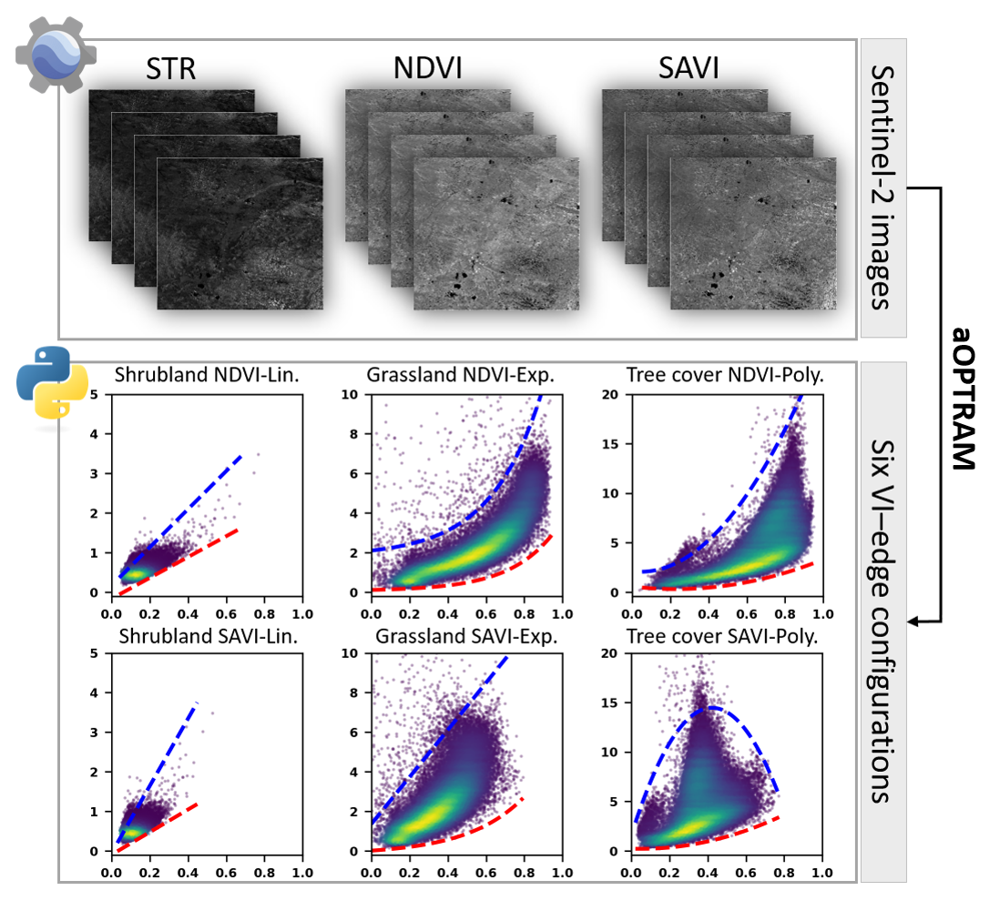

# Automated optical trapezoid model (aOPTRAM) 
This repository provides the code for generating OPTRAM-based soil moisture from Sentinel-2 imagery.

The implementation is associated with the following publication:

> **[A fully automated OPTRAM (aOPTRAM) for soil moisture retrieval: Evaluating multiple fitting functions, vegetation indices, land-cover types, and scales](https://www.sciencedirect.com/science/article/pii/S0034425726001501)**
> 
> Zhe Dong, Micha Silver, Gregory Okin, [Arnon Karnieli*](https://karnieli-rsl.com/personnel/)
> 
> *Remote sensing of environment*, 2026

## Introduction

  

This repository contains the implementation of automated OPTRAM (aOPTRAM) for soil moisture retrieval from Sentinel-2 imagery. By automatically identifying dry and wet edges in STR–VI space using an Adaptive Sliding Window (ASW) algorithm, the framework improves the objectivity, reproducibility, and scalability of OPTRAM-based soil moisture estimation.

## Reference
[Original OPTRAM paper](https://www.sciencedirect.com/science/article/pii/S0034425717302493)
